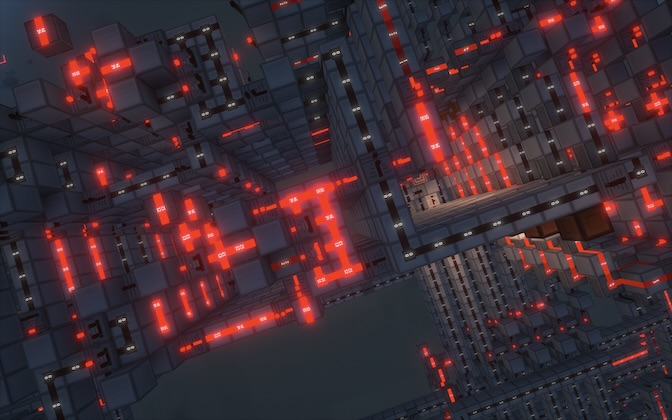

<h1>redtechpro</h1>

Minecraft reasorce pack that is a combination of textures from other packs. (vanilla tweaks, ocd pack, mattpack) that i put together for a better redstone experiance.

<h2>Changed Textures</h2>
<ul>
    <li>All Rails</li>
    <li>All Concrete</li>
    <li>All wool</li>
    <li>Comparater, Repeater</li>
    <li>Composter</li>
    <li>Daylight Detecter</li>
    <li>Dispenser, Dropper</li>
    <li>Glass Block</li>
    <li>Honey And Slime Block</li>
    <li>Hopper</li>
    <li>Iron Block And Trap Door</li>
    <li>Lever</li>
    <li>Note Block</li>
    <li>Observer</li>
    <li>All Pistons</li>
    <li>Redstone Dust, Lamp, Torch, and Block</li>
</ul>
<h2>Technical Features</h2>
<ul>
    <li>Redstone Block, and Lamp, Wool, Concrete, Glass Block, and Iron Block have visual borders</li>
    <li>Note Block has pitch in numbers</li>
    <li>Redstone Dust has power levels in numbers</li>
    <li>Lever has visual on and off indicater.</li>
    <li>Redstone Lamp has better contrast</li>
    <li>All textures are simpler</li>
</ul>
<h2>screenshots</h2>

<h2>packs used</h2>
<ul>
    <li>Vanilla Tweaks by Xisumavoid</li>
    <li>OCD Pack by AntonLando</li>
    <li>Mattpack by MattBatWings</li>
</ul>
<h2>notice</h2>
This project by jcampanile is lisensed under the MIT license.

